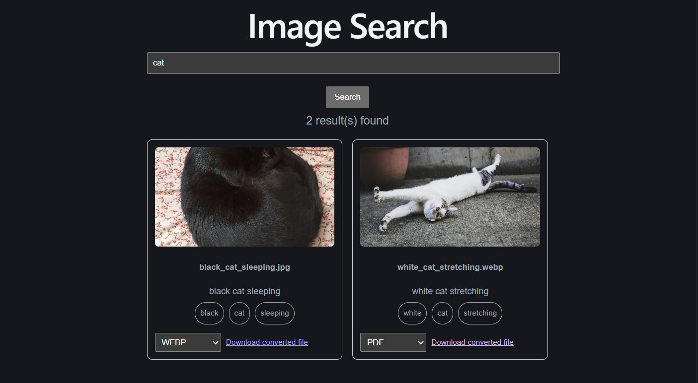

# Interactive-Algorithm-Visualizer/Image-Utility-Platform
## Overview
An interactive full-stack web application that visualizes KMP algorithm execution step-by-step to help users understand complex computational processes and utilizes the algorithm's string matching function for quick local image file search and convertion. The long-term goal of the platform is to support additional algorithms including DFA simulation and graph traversal algorithms (BFS/DFS), as well as external image search API integration.

## Demo
Live Demo: https://interactive-algorithm-visualizer-im.vercel.app/  
The search/convertion function is currently limited to the sample images stored in the repository, under backend/static/images.

## Completed features
### KMP visualizer

a Knuth-Morris-Pratt (KMP) string matching visualizer that demonstrates pattern searching, prefix table construction, and character-by-character comparisons through an intuitive graphical interface.

Built with a React frontend and FastAPI backend, the application generates detailed execution traces that allow users to navigate algorithm states, inspect internal variables, and observe how algorithm decisions evolve over time. The project aims to make fundamental computer science concepts more accessible through interactive visualization and real-time feedback.

#### Features
- Step-by-step visualization of the KMP string matching algorithm
- Interactive text and pattern comparison highlighting
- Dynamic LPS (Longest Prefix Suffix) table construction display
- Forward and backward navigation through algorithm execution states
- FastAPI backend that generates structured execution traces
- React-based frontend with real-time visualization updates
- Automated testing and continuous integration using Pytest, Git and GitHub Actions

#### Screenshots


### Local Image Utility Platform

An interactive full-stack application that enables users to locate images files using keyword-based pattern matching across filenames, tags, and descriptive metadata, then convert selected images to different formats. The framework leverages the Knuth-Morris-Pratt (KMP) string matching algorithm to efficiently identify relevant records and return searchable results through a responsive graphical interface.

Built with a React frontend and FastAPI backend, the application automatically indexes image assets, extracts searchable metadata from filenames, and generates a structured search database for efficient retrieval, with Docker containerization for fast deployment and Pillow for format convertions, as well as cloud deployment through Railway and Vercel. User queries are processed through a custom search engine that performs pattern matching against indexed file records and displays matching images with associated metadata. The project aims to bridge algorithmic pattern matching with practical search engine functionality while providing a foundation for future enhancements such as AI-generated image captions, desktop search capabilities and external search APIs.

#### Features

- Keyword-based image file search using the KMP string matching algorithm
  - Added a token-based search layer for fuzzy matching. KMP powers exact substring matching, while the search layer handles tokenization, ranking, and flexible query matching.
- FastAPI backend for search processing, indexing, and metadata retrieval
- React-based frontend with dynamic query submission and result rendering
- Static asset serving for image storage and retrieval
- Automated image indexing pipeline that scans directories and generates searchable metadata records
- Search across filenames, tags, descriptions, and indexed file metadata
- Interactive image gallery with real-time search results and metadata display
- Clickable image previews and filenames that link directly to original image assets through custom FastAPI preview and open file locations through Windows Explorer integration
  - Added a custom FastAPI preview route to serve image assets with inline display headers for consistent browser preview behavior across JPG, PNG, and WebP files.
  - Windows Explorer integration is only supported in local Windows execution mode, while Dockerized/live demo supports KMP visualization, image search, and preview.
- Format convertion options for uploaded files and search results using Pillow
- Automated testing and continuous integration using Pytest, Git, and GitHub Actions

#### Current Architecture

```text
Image Directory
       │
       ▼
Automated Indexing Script
       │
       ▼
Searchable Metadata Database (JSON)
       │
       ▼
FastAPI Search API
       │
       ▼
React Search Interface
```

#### Screenshots




## Local Usage
### Set up frontend and backend server
Local Windows execution mode
- cd backend
  - .\\.venv\Scripts\Activate.ps1
    - uvicorn main:app --reload
- cd frontend
  - npm run dev
Docker
- docker compose up --build

### Image metadata indexing
Store images under backend/static/images, then run:
- cd backend
  - py index_images.py

## Tech Stack

Frontend
- React
- Vite
- JavaScript
- Node.js

Backend
- Python
- FastAPI
- REST APIs
- Uvicorn
- Pillow

Development Tools
- GitHub/GitHub Actions
- VS Code
- Git
- Pytest
- Docker

Cloud deployment
- Vercel
- Railway